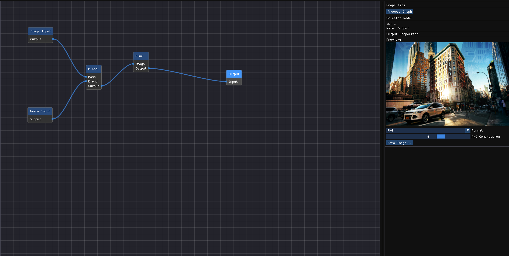

# Node-Based Image Processor

A C++ application providing a node-based interface for real-time image manipulation, inspired by tools like Substance Designer. Built with Dear ImGui, ImNodes, and OpenCV.



## Features

### Core Functionality
- Real-time node-based visual programming interface
- Live preview of image processing operations
- Automatic node execution ordering
- Result caching for performance
- Intuitive node connection system

### Processing Nodes
1. **Image Input Node**
   - Load JPG, PNG, BMP formats
   - Display image metadata (dimensions, format, size)

2. **Output Node**
   - Live preview window
   - Multiple export formats (PNG, JPEG, BMP)
   - Quality/compression settings

3. **Brightness/Contrast Node**
   - Brightness adjustment (-100 to +100)
   - Contrast control (0 to 3)
   - Reset functionality

4. **Color Channel Splitter**
   - RGB channel separation
   - Optional grayscale visualization
   - Colored/grayscale output modes

5. **Blur Node**
   - Gaussian blur (uniform)
   - Directional blur with angle control
   - Visual kernel preview
   - Configurable radius (1-20px)

6. **Threshold Node**
   - Multiple methods (Binary, Adaptive, Otsu)
   - Live histogram visualization
   - Configurable parameters per method

7. **Edge Detection Node**
   - Sobel and Canny algorithms
   - Configurable kernel sizes
   - Edge overlay mode

8. **Blend Node**
   - 5 blend modes (Normal, Multiply, Screen, Overlay, Difference)
   - Opacity control
   - Real-time preview

9. **Noise Generation Node**
   - Multiple noise types (Perlin, Simplex, Worley)
   - Configurable parameters
   - Optional displacement mapping

10. **Convolution Filter Node**
    - Custom 3x3 kernel editor
    - Preset filters (Sharpen, Emboss, Edge Enhance)
    - Visual kernel preview

## Building from Source

### Prerequisites

1. **MSYS2 (Windows)**
   ```bash
   # Install MSYS2 from https://www.msys2.org
   
   # Update MSYS2
   pacman -Syu
   pacman -Su
   
   # Install required packages
   pacman -S --needed base-devel mingw-w64-x86_64-toolchain git cmake make
   pacman -S mingw-w64-x86_64-opencv mingw-w64-x86_64-glfw
   ```

2. **Add MinGW to PATH**
   - Add `C:\msys64\mingw64\bin` to Windows System PATH
   - Restart terminal/VS Code

### Build Instructions

1. **Clone Repository**
   ```bash
   git clone https://github.com/PAAR16/node-based-image-processor.git
   cd node-based-image-processor
   ```

2. **Configure and Build**
   ```bash
   mkdir build
   cd build
   cmake -G "MinGW Makefiles" ..
   mingw32-make
   ```

3. **Run Application**
   ```bash
   ./NodeImageProcessor
   ```

## Usage Guide

1. **Adding Nodes**
   - Right-click on canvas
   - Select node type from menu
   - Position node on canvas

2. **Connecting Nodes**
   - Drag from output pin (right) to input pin (left)
   - Invalid connections are prevented automatically

3. **Adjusting Parameters**
   - Select node to show properties
   - Adjust values in properties panel
   - Results update in real-time

4. **Saving Results**
   - Connect to Output node
   - Configure format/quality
   - Click "Save Image" button

## License

This project is licensed under the MIT License - see the [LICENSE](LICENSE) file for details.

## Acknowledgments

- Dear ImGui
- ImNodes
- OpenCV
- GLFW